% Diseño de interfaces

Jenifer Tidwell (2010), "Chapter 2. Organizing the Content: Information Architecture and Application Structure", en _Designing Interfaces: Patterns for Effective Interaction Design_, pp. 25-76

---

Cualquier página en un sitio web hace principalmente una de estas cosas:

1. Mostrar una única cosa
2. Mosrtar una lista o conjunto de cosas
3. Ofrecer herramientas para crear una cosa
4. Facilitar una tarea

# Mostrar una única cosa

---

- Página larga de texto con scroll vertical
- Intefaz con posibilidad de hacer zoom de artefactos muy grandes y con mucho detalle
- Un reproductor multimedia

---

## Vistas alternativas {#alternativas}

<!--**Qué:** permite al usuario seleccionar vistas alternativas que son sustancialmente diferentes de la vista por defecto.

---

## Vistas alternativas

**Cuándo usarlo:** cuando se está creado algo que muestra o edita un documento o lista complejo, o un mapa u otro contenido del estilo. Requerimientos que presentan coflictos directos unos con otros.

---

## Vistas alternativas

**Por qué:** a veces es imposible acomodar diferentes requerimientos al mismo tiempo: versiones para impresión, por ejemplo. 
-->

---

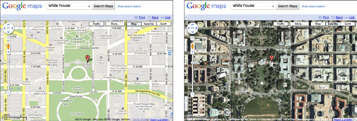

---

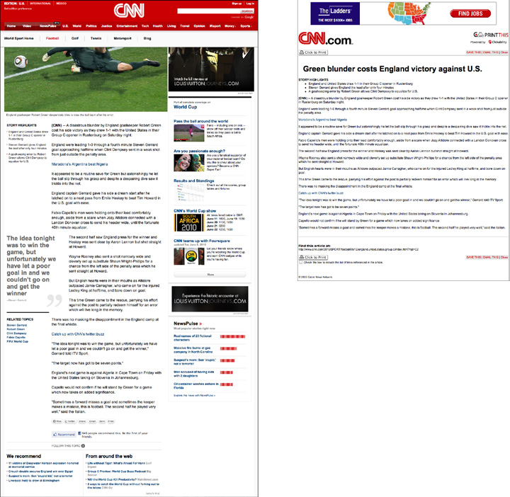

# Mostrar una lista o conjunto de cosas

--- 

Las listas presentan muchos retos:

- Longitud
- Jerarquía
- Orden
- Filtros, búsquedas

---

## Destacado, buscar y navegar

---

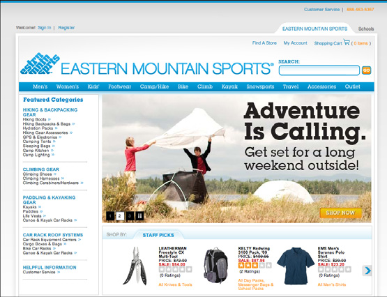

---

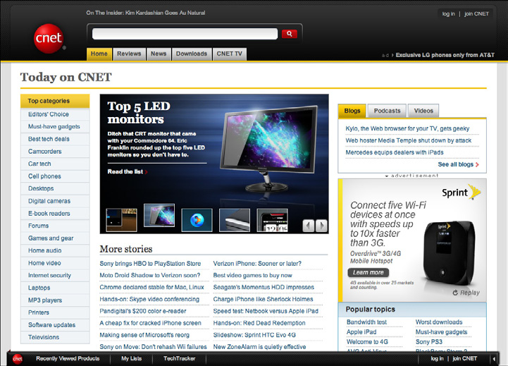

---

---

## Flujo de noticias

--- 

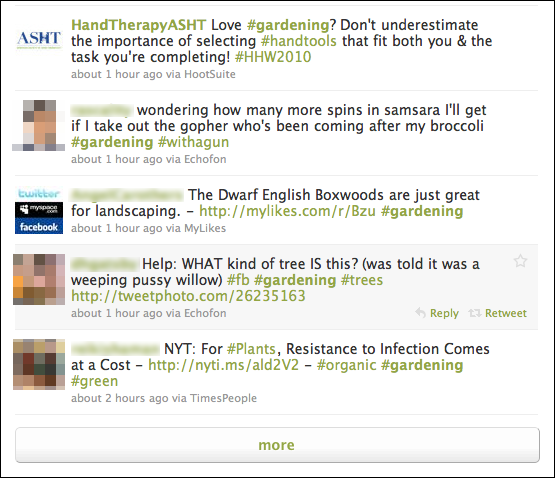

---

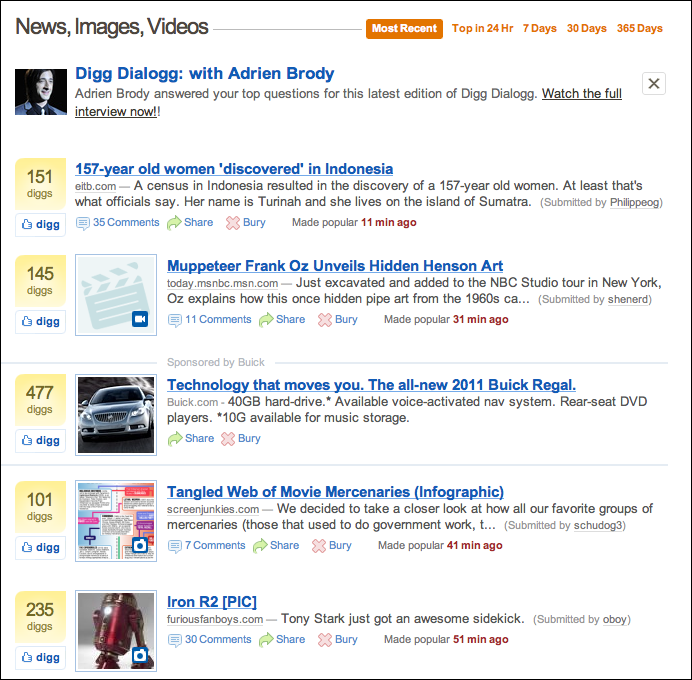

---

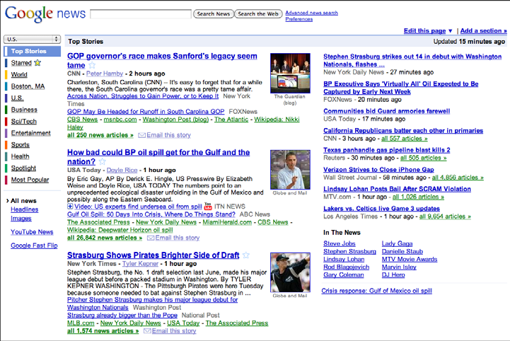

# Ofrecer herramientas para crear una cosa

---

Origen en software de escritorio tradicional: larga historia, amplia base de usuarios, estilos de interacción muy establecidos, utilizados a lo largo de muchos años. 

---

## Lienzo y paleta

---

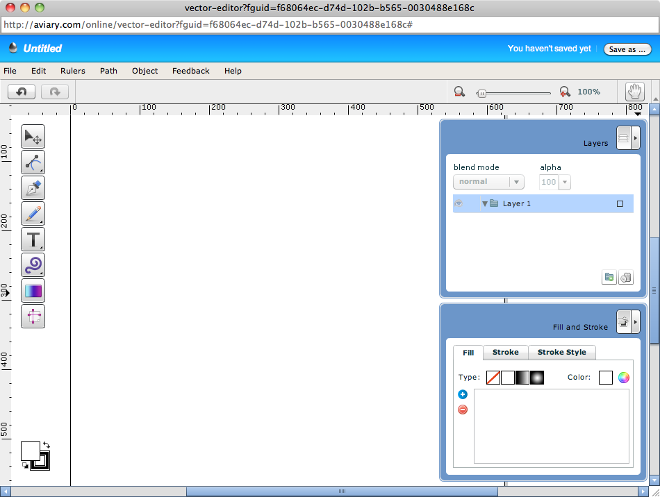

---

## Múltiples áreas de trabajo

--- 

## Vistas alternativas

---

(ver [ejemplos anteriores](#alternativas))

# Facilitar una tarea

---

Los formularios juegan un papel fundamental. 

Cuando la tarea es más compleja que la que puede alojarse en un área pequeña y contenida, hay trabajo en estructurarla.

---

## Wizard / Asistente

---

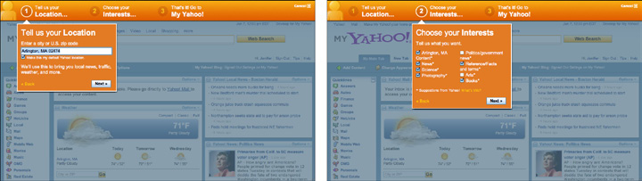

---

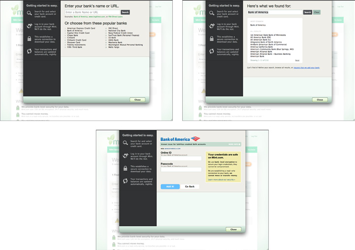

---

## Editor de ajustes

---

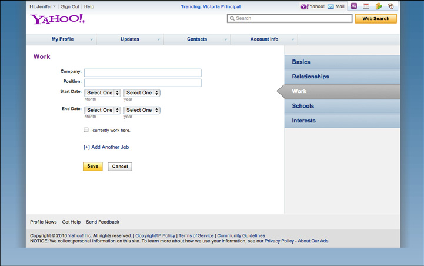

---

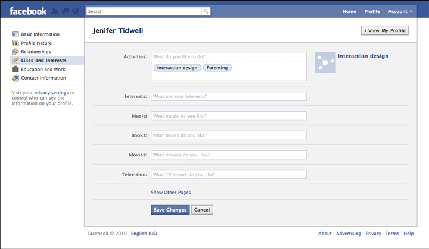

---

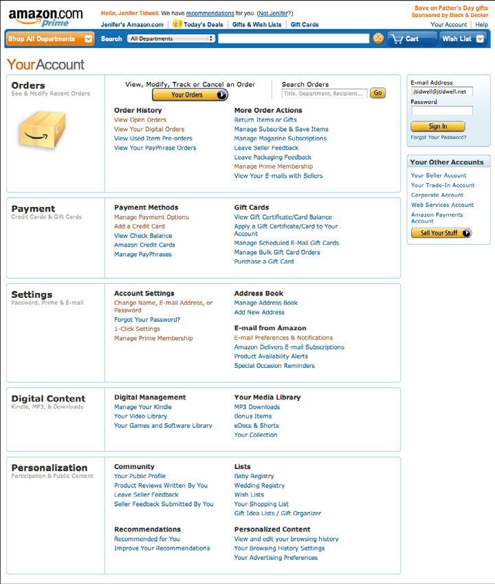